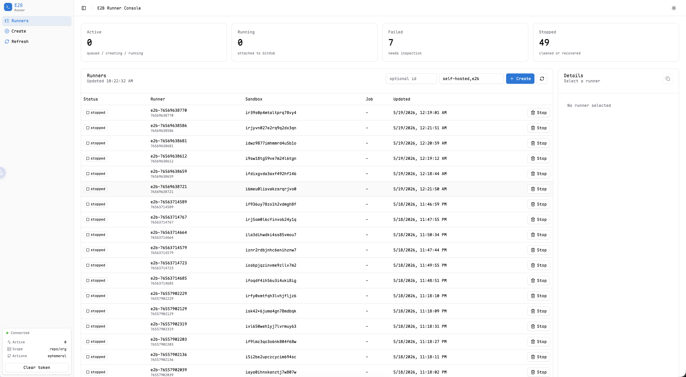

# Qiniu Sandbox GitHub Runner

[中文](README.zh.md)

Small Go service that starts ephemeral GitHub Actions self-hosted runners inside Qiniu sandbox instances.

## Configuration

Runtime configuration is file-first. `runnerd` reads `./runnerd.yaml` by default, or the path passed with `--config`.

Start from the example:

```bash
cp runnerd.yaml.example runnerd.yaml
```

The config file covers:

- server listen address and timeouts
- sqlite, Postgres, or MySQL database backend and DSN/path
- sandbox lifecycle timeouts
- GitHub webhook settings plus GitHub App, PAT, or basic auth
- GitHub App OAuth login for the admin console
- worker lease / retry / concurrency settings

Relative sqlite `database.dsn` and `github.app.private_key_file` paths are resolved from the directory containing `runnerd.yaml`. Legacy `database.url` is still accepted as a deprecated alias when `database.dsn` is empty.
Use sqlite for local and small single-node deployments. Postgres and MySQL are supported by the state store, but shared-database multi-instance operation should be verified in your deployment before advertising it as supported.
GitHub Enterprise Server is not currently supported; configure a GitHub.com App installation.
Configure exactly one GitHub auth method: `github.app`, `github.token`, or `github.basic_auth`. For GitHub App auth, `github.app.installation_id` is optional. When it is omitted, runnerd resolves the installation from each job repository and caches installation transports, allowing one GitHub App to serve multiple installed accounts.
Set `github.app.slug` to the GitHub App URL slug when you want the ordinary-user UI to show an Install GitHub App link.
`github.allowed_repositories` is an optional allowlist of `owner/repo` or `owner/*` patterns. Empty means all repositories that can deliver valid webhooks and match runner labels/policies are allowed.

`github.oauth` enables GitHub App OAuth login for the embedded console. Use the GitHub App's Client ID and Client secret, set a separate `auth.session_secret` for signed sessions, set a separate `auth.encryption_key` for encrypted user secrets, and configure the app callback URL as `/auth/github/callback` on your runnerd origin. Local accounts carry roles, while OAuth identities are matched by provider and stable subject; for GitHub this is the numeric user ID, while login is stored as display metadata. The first OAuth callback creates an account with `role: user` and links the GitHub identity when none exists. Ordinary users install the configured GitHub App; runnerd records the returned installation id and uses workflow job installation ids to decide which jobs the user can see. It does not copy the full GitHub App repository authorization scope into state. Only accounts with `role: admin` can access management APIs. Bootstrap the first admin with `runnerd --bootstrap-admin github:<github-user-id>`. OAuth sessions are stored as signed HttpOnly cookies.

Sandbox service API URL and API key are configured from the ordinary-user account or organization Preferences page. The API key is encrypted with `auth.encryption_key`; runnerd no longer reads Sandbox service credentials from `runnerd.yaml`.

`/webhooks/github` uses GitHub HMAC signature verification. The manual management API under `/runner_requests` requires a valid GitHub OAuth admin session cookie.

Runner state is persisted in a DB-backed store instead of per-request JSON directories. Control/stdout/stderr logs are kept as runner events and remain available from the admin API and UI.
Schema creation is GORM-model driven on startup. Existing state databases are migrated by `AutoMigrate` plus a narrow compatibility pre-pass for older schema columns, so keep old-schema upgrade tests green when changing state records.

## Run

```bash
go run ./cmd/runnerd --config ./runnerd.yaml
```

## Development

Install local tooling and UI dependencies once:

```bash
task deps
task ui-deps
```

Use a local config file for development so secrets and local sqlite state stay out of git:

```bash
cp runnerd.yaml.example runnerd.local.yaml
task dev
```

`task dev` starts the Vite UI dev server on the first available localhost port at or after `5173`, starts the smee webhook forwarder when `.smee-url` exists, and runs `runnerd` with the `development` build tag. The Go server still listens on the address from `runnerd.local.yaml`, commonly `:25500`, and proxies embedded UI assets to Vite. Open `http://127.0.0.1:25500/` for the ordinary-user PR/job view, `http://127.0.0.1:25500/repositories` for ordinary-user activity repositories, `http://127.0.0.1:25500/account/repositories` for GitHub App accounts and authorized repositories, `http://127.0.0.1:25500/account/preferences` for personal Sandbox service settings, or `http://127.0.0.1:25500/admin/` for the admin console while developing.

Set `RUNNERD_CONFIG` to use another config file, or `RUNNERD_VITE_PORT` to require a specific Vite port.

For local GitHub webhook forwarding, create a per-developer smee channel file:

```bash
echo 'https://smee.io/<your-channel>' > .smee-url
```

`task dev` will start the forwarder automatically. `task smee` is also available for standalone webhook forwarding and defaults to `http://127.0.0.1:25500/webhooks/github`. Set `SMEE_TARGET` if runnerd listens on another address.

## Docker

The container image is file-config only. Mount `runnerd.yaml` and any referenced secret files into the container; environment variables such as `HTTP_ADDR` are not used for runtime config.

```bash
docker run --rm -p 25500:25500 \
  -v "$PWD/runnerd.yaml:/etc/runnerd/runnerd.yaml:ro" \
  -v "$PWD/secrets:/etc/runnerd/secrets:ro" \
  ghcr.io/qiniu/ci-runner
```

Open the ordinary-user console at `http://127.0.0.1:25500/` or the admin console at `http://127.0.0.1:25500/admin/`. The UI is built from `ui/` with the same React, Vite, Tailwind CSS, shadcn-style components, and theme tokens used by `kubevirt-console`. The console offers GitHub sign-in and uses a signed HttpOnly cookie for API calls. Ordinary users see a two-column repository/PR job view at `/`, local activity repositories at `/repositories`, GitHub App accounts plus on-demand authorized repositories at `/account/repositories`, and Sandbox service settings at `/account/preferences` or `/organizations/{login}/preferences`. Admin users see the management console.

The admin console manages runner requests, runner specs, runner groups, runner policies, retry actions, audit history, runner-spec match tests, and diagnostics. Runner specs, groups, and repository policies are created through the admin API/UI rather than `runnerd.yaml`. runnerd creates repository runners by default; when a matched runner spec has a GitHub runner group, it creates an organization runner for the job repository owner and passes that group as `--runnergroup`.

Create runner specs with meaningful names such as `ubuntu-24-04` or `ubuntu-24-04-large`; set each spec `template_id` to the Qiniu sandbox template that contains the GitHub runner image. Template access is checked when runnerd starts a sandbox with the repository owner's Sandbox service Preferences. Runner specs with `default_available: true` are globally available to allowed installed repositories. Use `github.allowed_repositories` to limit which repositories can use this runnerd instance, and use runner policies when a repository needs access to an additional/special spec.

Runner requests are paginated by default: `GET /runner_requests` returns the most recent 100 rows unless `limit` and `offset` are provided, with `X-Total-Count`, `X-Limit`, `X-Offset`, and `Link` response headers. The admin console adds status, repository, and runner-spec filters on top of the current page and links each managed request to the GitHub Actions job when GitHub provides a job URL.

runnerd enforces both `worker.max_concurrent_runners` and per-spec `max_concurrency`. Requests above those limits remain in the DB as `queued` and are retried later; they are not dropped. Transient capacity signals such as Qiniu sandbox placement failures, HTTP 429, and GitHub secondary rate limits are treated as queue deferrals, so they keep waiting even after the normal retry counter reaches its configured cap. Other transient failures still use the configured retry backoff and eventually become `failed`; deterministic auth/config/template errors fail immediately.

runnerd caches valid GitHub registration tokens per repository or organization, retries runner registration inside the sandbox, and best-effort removes the GitHub runner registration when a sandbox is stopped or recovered.

The sandbox runner installs a pre-job hook that prints the Qiniu sandbox id, runner request id, and runner name in the GitHub Actions `Set up runner` log. Use that sandbox id to find the matching instance in the Qiniu sandbox console when debugging a job.

The binary also imports `github.com/jimmicro/pprof`, so a local-only pprof/expvar service is started automatically and discovered through generated `.pprof` address files and dump scripts. The admin console exposes a diagnostics page that summarizes the discovered pprof endpoint, `/debug/vars`, DB state, GitHub auth mode, retry/lease metrics, and recent failures. The expvar metrics include ARC-style workflow job counts, conclusions, failures, queue/run duration totals and counts, runner registration/cleanup counters, GitHub API operation counters, and Fireactions-style profile current/busy/idle/pending/desired gauges.



## Build

```bash
task build
task docker-build
task template-build-prod
```

`templates/github-runner-ubuntu-24.04` is the default GitHub runner image and includes the runner runtime, Docker support, helper tools, and `rclone`. Qiniu sandbox template builds use Taskfile targets that call `qshell sandbox template build` with a temporary copy of each template directory's `qshell.sandbox.toml`, so qshell-generated `template_id` values are not written back into tracked config. `templates/qbox-kodo-ubuntu-16.04` is an additional legacy Ubuntu 16.04 template for qbox/kodo-style jobs with the required old Go toolchains, apt packages, Docker support, and `rclone`. Its Docker base image is defined by `templates/qbox-kodo-ubuntu-16.04/base.Dockerfile` and can be rebuilt with `task qbox-kodo-base-build` before rebuilding the Qiniu sandbox template.

Useful validation commands:

```bash
task lint
task test
task docker-check
task release-check
```

Use `runs-on: [self-hosted, e2b]` in the target workflow. Configure a GitHub webhook for `workflow_job` events pointing at `POST /webhooks/github`; runnerd handles `queued`, `in_progress`, and `completed` actions. You can also include `workflow_run` events as a compensating signal; runnerd lists all queued jobs in the run and enqueues any matching jobs not already seen from `workflow_job`.

For a production-style readiness pass, use [docs/deployment-smoke.md](docs/deployment-smoke.md).
