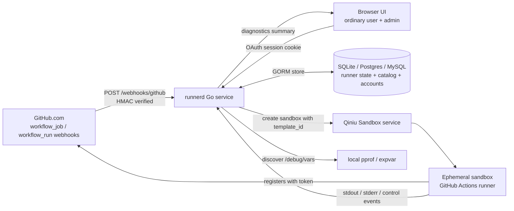
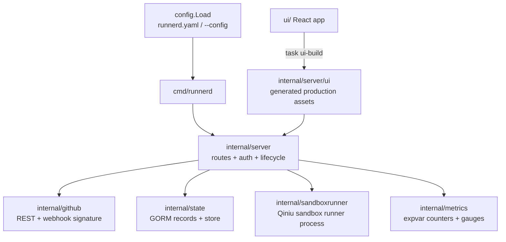
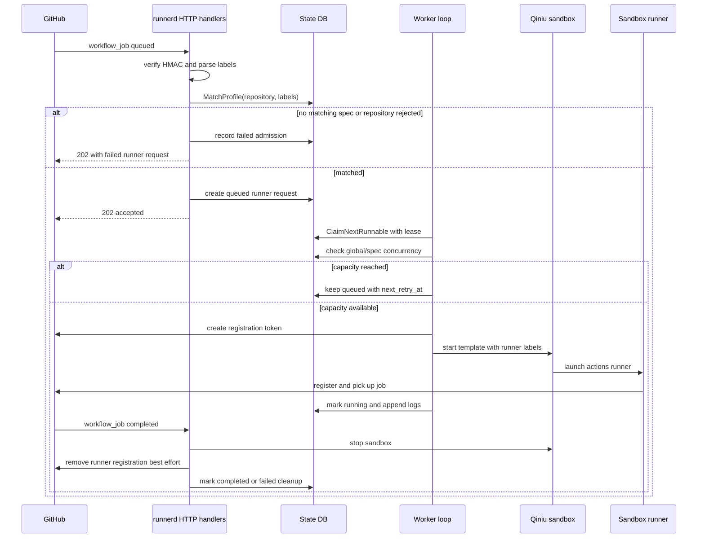
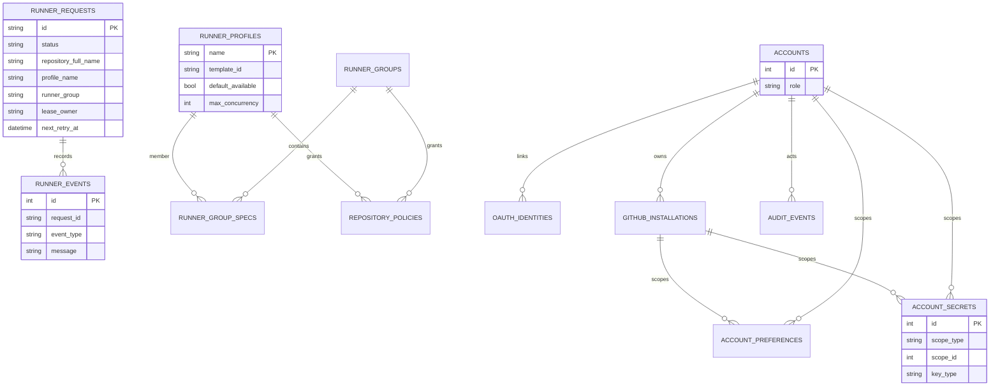
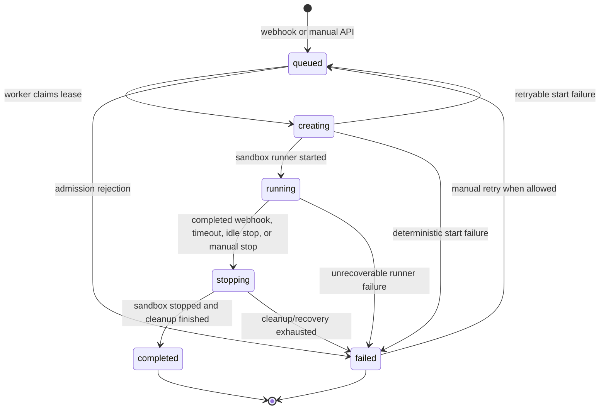
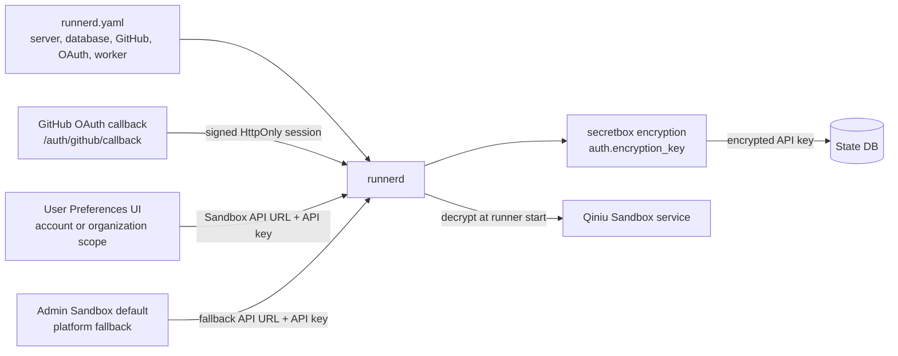

# Runner Architecture Comparison

This note records the design comparison that shaped runnerd. It should be read as historical context plus current baseline, not as an implementation plan.

## Current Baseline

runnerd is a single Go service that receives GitHub `workflow_job` webhooks, admits matching jobs by repository and labels, creates Qiniu sandboxes, registers ephemeral GitHub Actions self-hosted runners, and cleans them up after completion or stop.

Implemented pieces:

- File-first runtime config loaded from `runnerd.yaml` by default, or from `--config`.
- SQLite, Postgres, and MySQL state backends through `database.backend` and `database.dsn`.
- DB-backed runner requests, runner events/logs, runner specs, runner groups, repository policies, OAuth accounts, and audit events.
- Account and GitHub installation scoped Preferences for Sandbox service settings, with API keys stored as encrypted account secrets.
- An admin-managed, disabled-by-default Sandbox service fallback stored independently from account preferences.
- Schema creation is driven by GORM tags in the state record structs, with startup `AutoMigrate` and narrow compatibility backfills for older schema columns.
- Fixed runner states: `queued`, `creating`, `running`, `stopping`, `completed`, and `failed`.
- DB claim/lease processing with retry metadata (`retry_count`, `next_retry_at`, `lease_owner`, `lease_expires_at`).
- GitHub App auth with optional dynamic installation resolution, plus token and basic auth compatibility modes.
- GitHub App OAuth login for the admin console, with local roles and signed HttpOnly sessions.
- Ordinary-user UI for PR/job views, local activity repositories, GitHub App installations, authorized repositories, account or organization scoped Sandbox service Preferences, and scoped Sandbox template and runner-instance catalogs.
- Admin API and UI for runner requests, specs, groups, policies, the global Sandbox service fallback, retry/stop actions, match tests, audit history, and diagnostics.
- Production UI assets built from `ui/` into `internal/server/ui/`; development assets are proxied to Vite.
- Diagnostics through `github.com/jimmicro/pprof`, `/diagnostics/pprof`, `/diagnostics/vars`, and expvar metrics.

Known boundaries:

- GitHub Enterprise Server is rejected by config validation; only `https://api.github.com` is supported.
- Runner specs, runner groups, and repository policies are managed through the admin API/UI, not through `runnerd.yaml`.
- Token and basic auth still exist as compatibility modes. Product policy has not decided whether to keep them for production.
- Multi-instance behavior should not be advertised until two runnerd processes have been verified against the same database.
- Sandbox provider catalogs are ordinary-user resources, not admin configuration. `GET /user/sandbox/templates` and `GET /user/sandbox/instances` resolve scoped credentials and then the enabled admin fallback, accept only supported region ids, and keep secrets server-side.

## Architecture Overview

runnerd keeps the control plane in one Go process and stores durable state in the configured database. GitHub webhooks and the manual admin API create runner requests; background loops claim queued work, start Qiniu sandboxes, and reconcile or clean up runners after GitHub job events.

### Runtime Modules

The server package wires HTTP routes, GitHub clients, the state store, the sandbox service, and background loops. UI assets come from `ui/` and are either embedded production files or proxied to Vite in development.

### Runner Request Lifecycle

Admission and capacity are separate steps. Webhooks admit a request only after repository and label/spec policy checks pass. Capacity is checked later by the worker when it claims a queued request, so over-capacity work remains queued instead of being rejected.

### State Model

The configured database is the durable source for runner requests and control-plane objects. Logs are stored as runner events, and account or GitHub-installation scoped Sandbox API keys are encrypted before they enter the store.

### Request State Machine

The status values are intentionally small. Retryable failures move a request back to `queued` with retry metadata, while deterministic admission or configuration failures end at `failed`.

### Configuration And Secret Boundaries

`runnerd.yaml` configures service behavior, GitHub auth, OAuth login, database, and worker policy. Sandbox service credentials are not file config: ordinary users configure scoped credentials through Preferences, while admins may enable an independent platform fallback at `/admin/sandbox_service`. API keys are stored encrypted. The fallback audience is all repository owners or selected GitHub users/organizations matched by stable owner identity. Resolution order is request snapshot, installation custom/inherited config, eligible personal account config, enabled and audience-eligible admin default, then not configured.

## Comparison

| Dimension | runnerd now | Fireactions | Actions Runner Controller |
| --- | --- | --- | --- |
| Deployment | Single Go service | Runner orchestration service | Kubernetes operator |
| Compute | Qiniu sandbox | Firecracker microVM | Kubernetes pod |
| State source | SQLite/Postgres/MySQL DB | Service-managed pool state | Kubernetes API / CRD status |
| Scheduling input | GitHub webhooks + admin API | Pool desired/current state | Scale set/listener reconciliation |
| Runner selection | Runner specs, groups, policies, label matching | Pool/profile selection | Runner groups and scale sets |
| Auth | GitHub App, token, or basic auth | GitHub App | GitHub App / scale set auth |
| Diagnostics | Admin diagnostics + pprof/expvar | Pool metrics | Controller/workflow metrics |
| Operational scope | Lightweight service for Qiniu sandbox runners | Dedicated VM runner platform | Full Kubernetes-native controller |

runnerd intentionally keeps the Qiniu sandbox execution model and avoids the Kubernetes control-plane complexity of ARC. The useful ideas carried over are the reconciliation mindset, repository visibility rules, profile/spec-based runner selection, and workflow job metrics.

## Scheduling Model

Admission uses the GitHub webhook payload repository and labels. A runner request is admitted only when:

- the webhook HMAC signature is valid;
- `github.allowed_repositories` permits the repository, if configured;
- a runner spec or runner group/policy can satisfy the job labels;
- the matched spec is enabled.

`runner_specs.default_available: true` makes a spec globally available to allowed installed repositories. Repository policies can grant additional specs or groups to specific repositories or repository patterns. When a spec includes a GitHub runner group, runnerd creates an organization runner for the job repository owner and passes that group as `--runnergroup`.

Capacity is checked later when the worker starts a queued request. Requests above global or per-spec concurrency limits remain `queued` and are retried later. Transient placement/rate-limit signals are treated as queue deferrals instead of hard failures.

## State And Recovery

Runner state is database-backed. The worker claims runnable requests with lease metadata, moves them through the state machine, and releases or retries work based on outcome. The sweeper/reconciler loops handle:

- stale `creating` requests;
- timed-out `stopping` cleanup;
- active runners that need recovery after restart;
- mismatches between original workflow jobs and assigned GitHub jobs.

The design deliberately uses portable DB semantics rather than relying on Postgres-only locking features for the core path. SQLite remains valid for local and small single-node deployments; Postgres and MySQL are available for more durable deployments, pending multi-process validation.

The schema source of truth lives in `internal/state/records.go`. Startup migration runs a narrow legacy-column compatibility pass in `internal/state/db.go` before GORM `AutoMigrate`. This keeps fresh database creation model-driven while preserving known older sqlite upgrade paths such as `runner_profiles.default_available` and `repository_policies.runner_group_name`.

## Diagnostics

The service imports `github.com/jimmicro/pprof`, which starts a local-only pprof/expvar service and writes discovery files near the binary. The admin diagnostics endpoint summarizes:

- discovered pprof address files and dump scripts;
- DB backend/path, with secrets redacted;
- GitHub auth mode and installation details;
- retry, lease, runner lifecycle, GitHub API, and workflow metrics;
- recent failure state.

The admin UI should display diagnostics summaries, not expose raw pprof directly to the public internet.

## Remaining Design Decisions

- Decide whether GitHub token and basic auth remain supported compatibility modes or should be removed for production.
- Decide whether ordinary-user Activity repositories should include policy-configured repositories before runnerd has observed jobs from them.
- Add an effective-config or config-validation workflow only if operators need UI-based runtime config inspection.
- Verify shared-database lease behavior with two runnerd processes before documenting multi-instance support.
- Decide whether expvar is enough or whether a Prometheus/export adapter is needed.
