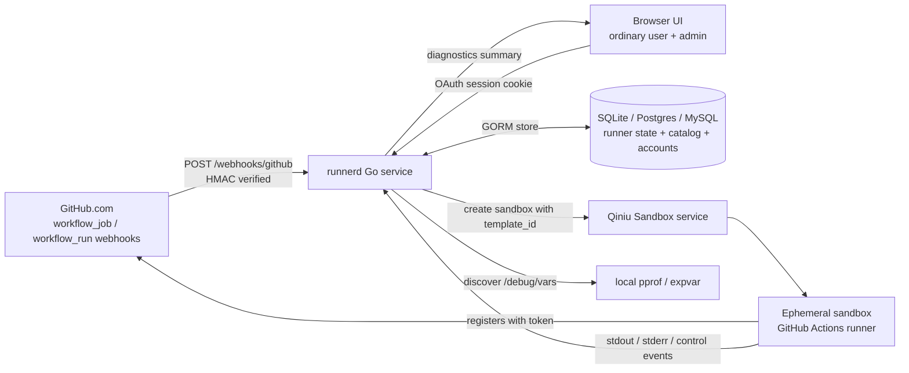
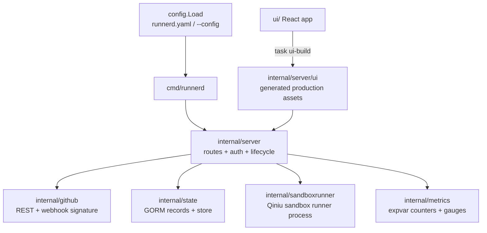
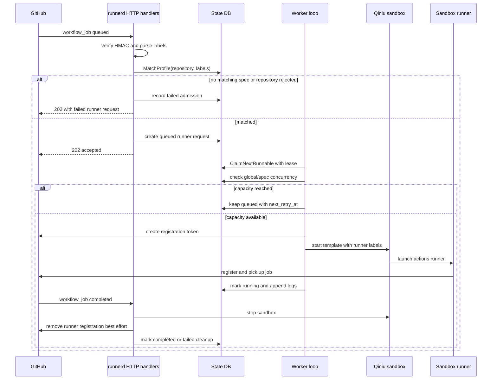
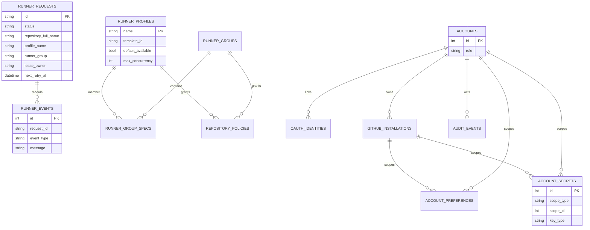
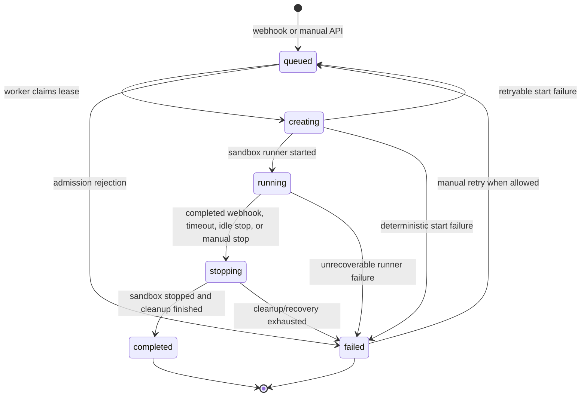
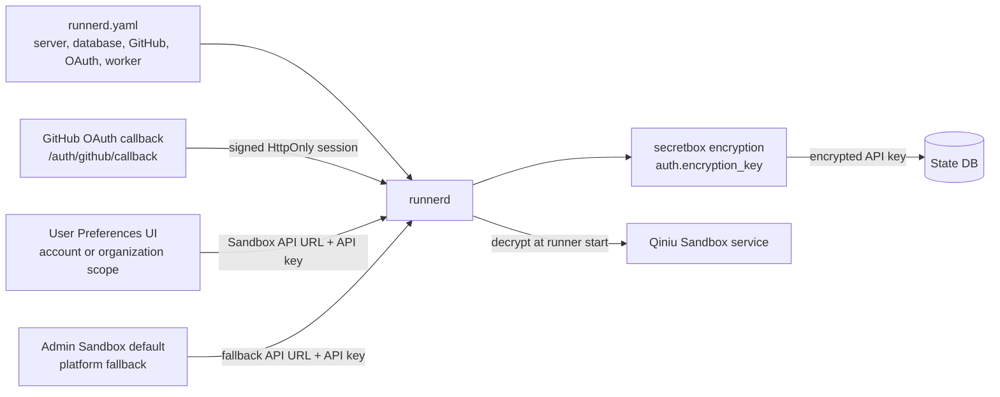

# Runner 架构对比

[English](../runner-architecture-comparison.md)

本文记录塑造 runnerd 的设计对比。它应被视为历史背景和当前基线，而不是待实现计划。

## 当前基线

runnerd 是单个 Go 服务：接收 GitHub `workflow_job` webhooks，根据 repository 和 labels 准入匹配的 jobs，创建 Qiniu sandboxes，注册临时 GitHub Actions self-hosted runners，并在完成或停止后清理它们。

已实现部分：

- File-first runtime config，默认从 `runnerd.yaml` 加载，也可通过 `--config` 指定。
- 通过 `database.backend` 和 `database.dsn` 支持 SQLite、Postgres 和 MySQL state backends。
- DB-backed runner requests、runner events/logs、runner specs、runner groups、repository policies、本地 accounts、关联 OAuth identities、account preferences/secrets 和 audit events。
- Account 和 GitHub installation scoped Preferences 用于 Sandbox service settings，API keys 作为 encrypted account secrets 保存。
- 独立于 account preferences 的 admin-managed Sandbox service fallback，默认关闭。
- Schema creation 由 state record structs 中的 GORM tags 驱动，启动时先执行窄范围 legacy compatibility pass，再运行 `AutoMigrate`；GORM foreign-key creation 有意保持关闭。
- 固定 runner states：`queued`、`creating`、`running`、`stopping`、`completed` 和 `failed`。
- DB claim/lease processing，带 retry metadata（`retry_count`、`next_retry_at`、`lease_owner`、`lease_expires_at`）。
- GitHub App auth 支持可选 dynamic installation resolution，同时保留 token 和 basic auth compatibility modes。
- GitHub App OAuth 用于普通用户和管理员登录，本地 roles 决定管理权限，session 使用 signed HttpOnly cookie。
- Ordinary-user UI 支持 PR/job views、local activity repositories、GitHub App installations、authorized repositories、account 或 organization scoped Sandbox service Preferences，以及 scoped Sandbox template 和 runner-instance catalogs。
- Admin API 和 UI 支持账户列表与带审计的角色控制、runner requests、specs、groups、policies、全局 Sandbox service fallback、retry/stop actions、match tests、audit history 和 diagnostics。
- Production UI assets 从 `ui/` 构建到 `internal/server/ui/`；development assets 代理到 Vite。
- 通过 `github.com/jimmicro/pprof`、`/diagnostics/pprof`、`/diagnostics/vars` 和 expvar metrics 提供 diagnostics。

已知边界：

- Config validation 拒绝 GitHub Enterprise Server；只支持 `https://api.github.com`。
- Runner specs、runner groups 和 repository policies 通过 admin API/UI 管理，不是 `runnerd.yaml` 字段。
- Token 和 basic auth 仍作为 compatibility modes 存在。产品策略尚未决定是否为生产长期保留。
- 在用两个 runnerd 进程连接同一个 database 验证前，不应宣传 multi-instance support。
- Sandbox provider catalogs 是普通用户资源，不是 admin 配置。`GET /user/sandbox/templates` 和 `GET /user/sandbox/instances` 会先解析 scoped credentials，再尝试已启用的 admin fallback，只接受支持的 region id，并把 secrets 保留在服务端。
- Account 管理仅包含角色控制：account 和 identity link 仍由 OAuth/bootstrap 创建。系统拒绝修改自身角色，以及可能导致没有管理员的变更。

## 架构总览

runnerd 将控制面保持在一个 Go 进程中，并把持久状态保存在配置的数据库中。GitHub webhooks 和手动 admin API 创建 runner requests；后台 loops claim queued work、启动 Qiniu sandboxes，并在 GitHub job events 后 reconcile 或清理 runners。

### Runtime Modules

`internal/server` 连接 HTTP routes、GitHub clients、state store、sandbox service 和 background loops。UI assets 来自 `ui/`，生产环境嵌入，开发环境代理到 Vite。

### Runner Request 生命周期

Admission 和 capacity 是两个独立步骤。Webhooks 只有在 repository 和 label/spec policy checks 通过后才准入 request。Capacity 由 worker claim queued request 后再检查，因此超过容量的工作会保持 queued，而不是被 admission 阶段拒绝。

### State Model

配置的数据库是 runner requests 和控制面对象的持久事实来源。Logs 作为 runner events 存储；account 或 GitHub-installation scoped Sandbox API keys 会在进入 store 前加密。

### Request State Machine

Status values 有意保持小集合。Retryable failures 会带着 retry metadata 回到 `queued`，确定性的 admission 或 configuration failures 会进入 `failed`。

### 配置和密钥边界

`runnerd.yaml` 配置 service behavior、GitHub auth、OAuth login、database 和 worker policy。Sandbox service credentials 不是 file config：普通用户通过 Preferences 配置 scoped credentials，管理员可在 `/admin/sandbox_service` 启用独立的平台回退。API keys 加密后存储。fallback audience 可以是全部 repository owners，或按 stable owner identity 匹配的 selected GitHub users/organizations。解析顺序为 request snapshot、installation custom/inherited 配置、符合条件的个人账户配置、已启用且 audience eligible 的 admin default，最后是未配置错误。

## 对比

| 维度 | runnerd now | Fireactions | Actions Runner Controller |
| --- | --- | --- | --- |
| 部署方式 | 单个 Go 服务 | Runner 编排服务 | Kubernetes Operator |
| 计算资源 | Qiniu 沙箱 | Firecracker 微型虚拟机 (microVM) | Kubernetes Pod |
| 状态事实源 | SQLite/Postgres/MySQL 数据库 | 服务管理的连接池状态 | Kubernetes API / CRD 状态 |
| 调度输入 | GitHub Webhooks + 管理 API | 连接池期望/当前状态 | 伸缩组/监听器调和 |
| Runner 选择 | Runner 规格、组、策略、标签匹配 | 连接池/配置选择 | Runner 组和伸缩组 |
| 鉴权方式 | GitHub App、Token 或 Basic 鉴权 | GitHub App | GitHub App / scale set 鉴权 |
| 诊断信息 | 管理端诊断 + pprof/expvar | 连接池指标 | 控制器/工作流指标 |
| 运维范围 | 适用于 Qiniu 沙箱 Runner 的轻量级服务 | 专用的虚拟机 Runner 平台 | 完整的 Kubernetes 原生控制器 |

runnerd 有意保留 Qiniu sandbox execution model，避免 ARC 的 Kubernetes control-plane complexity。吸收的有用思想包括 reconciliation mindset、repository visibility rules、profile/spec-based runner selection 和 workflow job metrics。

## 调度模型

Admission 使用 GitHub webhook payload 中的 repository 和 labels。Runner request 只有在以下条件满足时才会被准入：

- webhook HMAC signature 有效；
- 如果配置了 `github.allowed_repositories`，repository 被允许；
- runner spec 或 runner group/policy 可以满足 job labels；
- 匹配到的 spec 已启用。

`runner_specs.default_available: true` 让 spec 对允许的已安装仓库全局可用。Repository policies 可以给具体 repositories 或 repository patterns 授权额外 specs 或 groups。当 spec 包含 GitHub runner group 时，runnerd 会为 job repository owner 创建 organization runner，并传入该 group 作为 `--runnergroup`。

Capacity 在 worker 启动 queued request 时检查。超过 global 或 per-spec concurrency limits 的 requests 会保持 `queued` 并稍后重试。Transient placement/rate-limit signals 会作为 queue deferrals，而不是 hard failures。

## State And Recovery

Runner state 是 database-backed。Worker 使用 lease metadata claim runnable requests，使其在 state machine 中流转，并按结果 release 或 retry work。Sweeper/reconciler loops 处理：

- stale `creating` requests；
- timed-out `stopping` cleanup；
- restart 后需要 recovery 的 active runners；
- original workflow jobs 和 assigned GitHub jobs 不一致的情况。

核心路径有意使用 portable DB semantics，而不是依赖 Postgres-only locking features。SQLite 对本地和小型 single-node deployments 仍有效；Postgres 和 MySQL 可用于更 durable deployments，但 multi-process validation 仍待完成。

Schema source of truth 位于 `internal/state/records.go`。Startup migration 会先在 `internal/state/db.go` 中运行窄范围 legacy compatibility pass，再运行 GORM `AutoMigrate`。这样 fresh database creation 仍保持 model-driven，并保留缺失 columns 和 obsolete OAuth constraints 的已知旧 sqlite upgrade paths。缺少 scope columns 的不兼容 legacy account preference/secret tables 会被有意删除并重建，其中的数据不会迁移。运维人员必须重新配置受影响的 Sandbox settings/API keys，相关用户还需重新通过 GitHub 认证后才能同步 installations。

## Diagnostics

服务导入 `github.com/jimmicro/pprof`，它会启动 local-only pprof/expvar service，并在 binary 附近写入 discovery files。Admin diagnostics endpoint 汇总：

- discovered pprof address files 和 dump scripts；
- DB backend/path，secret 会 redacted；
- GitHub auth mode 和 installation details；
- retry、lease、runner lifecycle、GitHub API 和 workflow metrics；
- recent failure state。

Admin UI 应展示 diagnostics summaries，而不是把 raw pprof 直接暴露到公网。

## 剩余设计决策

- 决定 GitHub token 和 basic auth 是继续作为 supported compatibility modes，还是为 production 移除。
- 决定 ordinary-user Activity repositories 是否应在 runnerd 观察到 jobs 前包含 policy-configured repositories。
- 只有当 operators 需要 UI-based runtime config inspection 时，才添加 effective-config 或 config-validation workflow。
- 在记录 multi-instance support 前，用两个 runnerd 进程共享同一个 database 验证 lease behavior。
- 决定 expvar 是否足够，或是否需要 Prometheus/export adapter。
